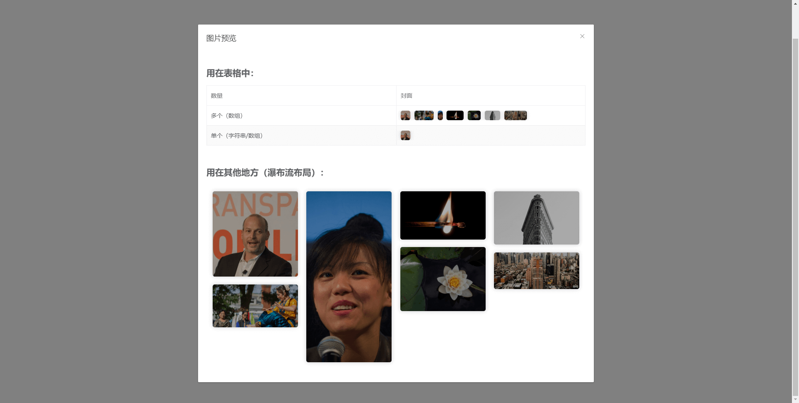
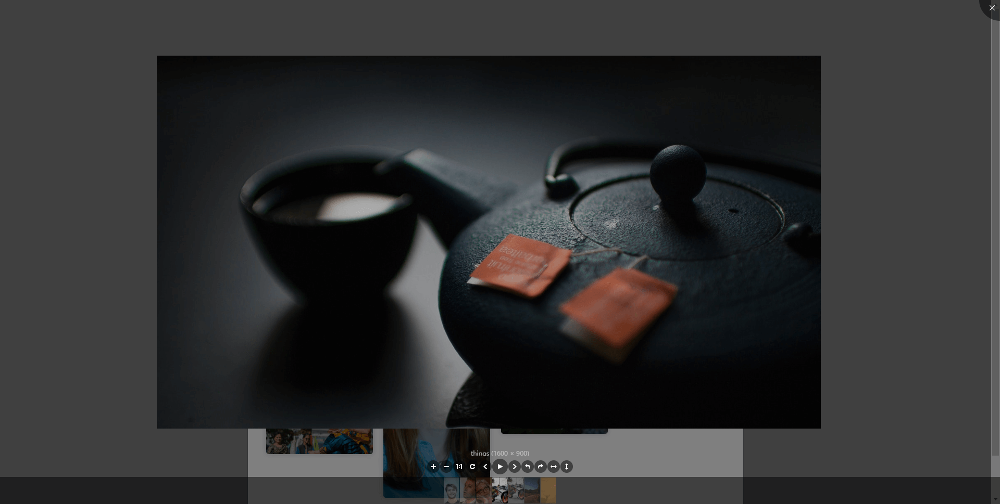

# pic-viewer / 图片画廊



<br>



## Features

- √ `viewerjs` 的 vue 版本 增加了预览前的外部展示 使其开箱即用
- √ 多样的展示形式：支持文档流、轮播图、自适应瀑布流、嵌套在表格内
- √ 灵活的数据类型：支持字符串、字符串数组、JSON字符串、对象数组
- √ 支持二维码
- √ 全局或局部引入 参数支持全局或局部配置

<br>

## Installation


Dependencies：vue

```ts
// 全局引入

import 'pic-viewer/dist/style.css'
import PicViewer from 'pic-viewer'

Vue.use(PicViewer, {
  // 全局配置
})
```

```vue
<!-- 局部引入 -->

<template>
  <PicViewer v-bind="config"/>
</template>

<script>
import 'pic-viewer/dist/style.css'
import PicViewer from 'pic-viewer'

export default {
  components: { PicViewer },
  data () {
    return {
      config: {
        // 局部配置
      }
    }
  }
}
</script>
```

<br>

## Props

| Attribute | Description | Type | Options | Default |
| --- | --- | --- | --- | --- |
| value | img link(s) | string / array[string] / array[object] | | |
| pattern |  display pattern | string | 'waterfall', 'swiper', 'table-cell' | undefined, means **normal flow** |
| viewerjs | indicate if enable viewerjs or not | boolean | | true |
| viewerjsProps* |  props of [viewerjs](https://github.com/fengyuanchen/viewerjs) | object | | |
| objectKey | if type of value is array[object], you need to specify the img key of object | string | | |
| swiperProps* |  props of [swiper](https://swiperjs.com/swiper-api) | object | | |
| qrcode* | turning value into qrcode | boolean, string | true, false, 'auto' | false |
| qrcodeProps* | props of [qrcode](https://github.com/soldair/node-qrcode) dependency | object | | |

### qrcode

::: tip  
如果将 qrcode 设为 'auto'，pic-viewer 会自动判断是否需要转换（value 为 base64 或 url 时不会转换）
:::

### viewerjsProps

```
// 默认值

{
  zIndex: 5000,
}
```

### qrcodeProps

```
// 默认值

{
  margin: 0,
  scale: 400,
  errorCorrectionLevel: 'L',
  width: 148,
  height: 148,
}
```

### swiperProps

```
// 默认值

{
  observer: true,
}
```

<br>

## Config rules

- 所有参数均支持全局或局部配置

权重：

- 局部配置高于全局配置
- 对于对象类型的参数 局部配置会与全局配置进行合并 同名属性会被局部配置覆盖

<br>

## Events

| Name | Description | Callback's arguments |
| --- | --- | --- |
| click | 点击图片后触发 | { src, index } |

<br>

## Slots

| Name | Description |
| --- | --- |
| 默认插槽 | 自定义img标签 |

```html
<!-- 示例 -->

<PicViewer>
  <template v-slot="{ src, index }">
    
    <div>第{{ index + 1 }}张</div>
  </template>
</PicViewer>
```

<br/>

## Methods

| Method | Description | Parameters |
| --- | --- | --- |
| preview | preview manually | index of value array (default: 0) |

<br>

## 编程式调用预览

Preview manually, no external display

```html

<PicViewer :value="" v-show="false" ref="PicViewer"/>
<button @click="()=>{$refs.PicViewer.preview(6)}">preview</button>
```

<br>

## 二维码清晰度

```html
<!-- 如果 value 的值比较小 而 size 的值比较大 会导致图片模糊 此时可以增大 scale 来解决 -->
<!-- scale 指二维码每个黑点占用的 px 数量 可选值为整数的二次方 如25 36 49 64 81 -->

<PicViewer :qrcodeProps="{
  scale: 900,
}"/>
```

<br>

## 获取 swiper 实例

```vue

<template>
  <PicViewer pattern="swiper" ref="picViewer" :swiperProps="{
    on: {
      init: onSwiperInit,
    },
  }"/>
</template>

<script>
import 'pic-viewer/dist/style.css'
import PicViewer from 'pic-viewer'

export default {
  components: { PicViewer },
  data () {
    return {
      swiper: null
    }
  },
  methods: {
    onSwiperInit () {
      this.$nextTick(() => {
        this.swiper = this.$refs.picViewer.swiper
      })
    }
  }
}
</script>
```
