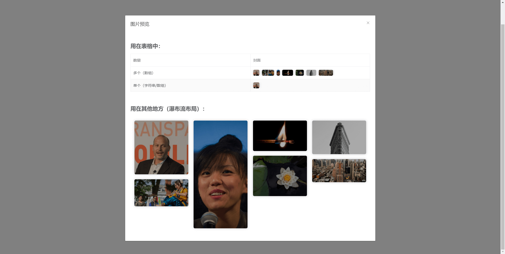
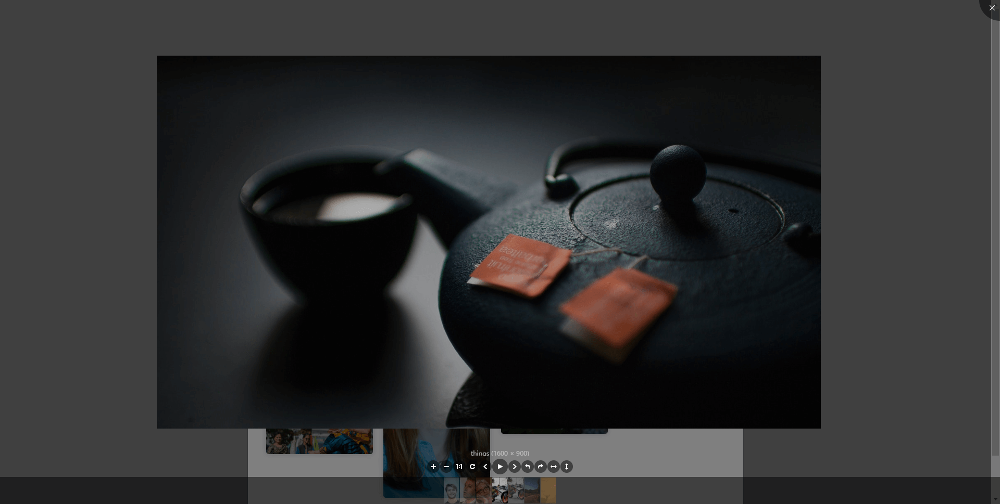

# pic-viewer / 图片预览



<hr/>



### Feature

- √ viewerjs的vue版本 增加了预览前的外部展示 使其开箱即用
- √ 支持自适应瀑布流展示、嵌套在表格内展示
- √ 灵活的数据类型：支持字符串/字符串数组/对象数组
- √ 友好的hover交互
- √ 支持全局安装/单独引入

### Installation

``` bash
$ yarn add pic-viewer
```

**Dependencies**：vue

<hr/>

```js
import { PicViewer } from 'pic-viewer'
components: { PicViewer }
```

**Globally:**
```js
import PicViewer from 'pic-viewer'
Vue.use(PicViewer)
```

### Quick Start

**Waterfall Layout:**
```html
<PicViewer :value=""/>
```

**Normal Flow Layout:**

> Typically used in tables

Here's an example for element-ui:

```html
<el-table>
  <el-table-column>
    <template slot-scope="{ row }">
      <PicViewer :waterfall="false" :value="row.img"/>
    </template>
  </el-table-column>
</el-table>
```

**Preview manually, no external display:**
```html
<PicViewer :value="" v-show="false" ref="PicViewer"/>
<button @click="() => { $refs.PicViewer.preview(6) }">preview</button>
```

| Attribute | Description | Type | Options | Default |
| --- | --- | --- | --- | --- |
| value | img link[s] | String / Array[String] / Array[Object] | | |
| objectKey | if type of value is Array[Object], you need to specify the img key of object | String | | |
| waterfall | whether the layout is waterfall | Boolean | | true |

| Method | Description | Parameters |
| --- | --- | --- |
| preview | preview manually | index of value array (default: 0) |
